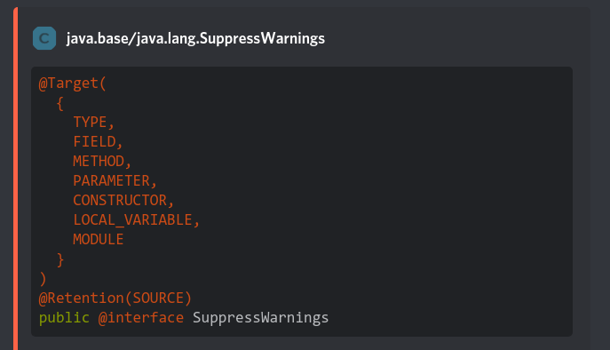

# Doctor - A Discord Javadoc bot


----

## What is Doctor?
Doctor is a Discord bot that indexes Java source code using
[Spoon](https://github.com/INRIA/spoon), building up a model of the source
code. It then transforms the model into a SQLite database for quick and easy
lookups.

Due to this understanding of the source code, Doctor can handle any
program up to Java 15 without breaking when the Javadoc HTML Doclet is updated.
Additionally, Doctor can resolve symbols and other elements the way your Java
compiler does and should (theoretically) be able to answer queries, no matter
the inheritance and other relationships the elements may have.

## Features
- Fuzzy match the user's query against its databases to find all relevant matches
- Provide the user with Discord Buttons if their query was ambiguous. The full
  names of elements will be intelligently shortened but are still unambiguous.
  This means you might see `util.List` and `awt.List` as button labels, but not
  `java.util.List` and `java.awt.List`. This is especially useful for methods,
  as qualifying every parameter would be quite verbose.
- Slash command integration
- Provide a short and long version of the relevant Javadoc right in Discord
- Format the Declarations to fit into the embed width limit and still look
  alright:  
  

## Deploying Doctor

### Config
Doctor requires a configuration file (you can have a look at the sample file in
[src/main/resources](src/main/resources)) and then as many SQLite database as
you have indexed. You can index your own software using
[JavadocApi](https://github.com/I-Al-Istannen/JavadocApi).

### Docker
A simple Dockerfile to run this bot could like the following:
```dockerfile
FROM openjdk:16-slim

RUN useradd -m doctor

COPY config.json /home/doctor/config/config.json
COPY databases/* /home/doctor/databases/

USER doctor

COPY Doctor.jar /home/doctor/Doctor.jar

ENTRYPOINT ["java", "-jar", "/home/doctor/Doctor.jar", "/home/doctor/config/config.json"]
```
